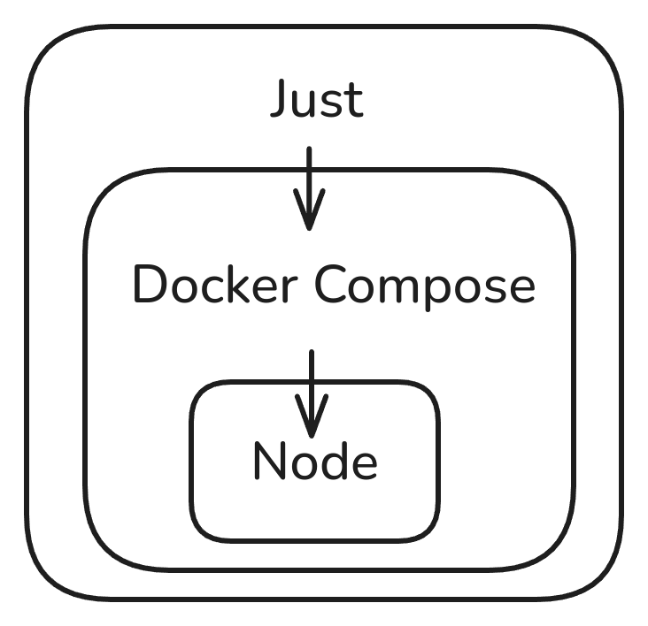

# Opire Contributing Guide

Hi! We are really excited that you are interested in contributing to Opire. Before submitting your contribution, please make sure to take a moment and read through the following guidelines:

- [Code of Conduct](https://github.com/opire/.github/blob/main/CODE_OF_CONDUCT.md)
- [Issue Reporting Guidelines](#issue-reporting-guidelines)
- [Pull Request Guidelines](#pull-request-guidelines)
- [Development Setup](#development-setup)
- [Project Structure](#project-structure)
- [Contributing Tests](#contributing-tests)
- [Financial Contribution](#financial-contribution) 

## Issue Reporting Guidelines

> TLDR: Always use our issue templates when creating an issue and provide as much information as possible.

To ensure your issue is understood and addressed effectively, clearly state your goal when opening an issue. Provide a detailed explanation of what you’re requesting, keeping in mind that someone else needs to fully grasp your intent.

If you're reporting a bug, include a step-by-step method to reproduce it, along with detailed information about your system, software versions, and any other relevant details. For feature requests, describe how the new feature should function and any important considerations.

The various issue templates are designed to guide you in providing the necessary information, so select the most appropriate template and complete all required fields thoroughly.

### Reporting Security Vulnerabilities Issues

If you discover a security vulnerability, please follow our [Security Policy](https://github.com/opire/.github/blob/main/SECURITY.md) and report it to us sending an email to [team@opire.dev](mailto:team@opire.dev). We take security vulnerabilities seriously and will respond quickly to your report.

## Pull Request Guidelines

We accept every pull request. However, we have a few guidelines that we ask you to follow to ensure that your pull request is accepted:

- **Fork the repository** and create your branch from `main`. [Make sure to tick the "Allow edits from maintainers" box](https://docs.github.com/en/pull-requests/collaborating-with-pull-requests/working-with-forks/allowing-changes-to-a-pull-request-branch-created-from-a-fork). This allows us to directly make minor edits / refactors and saves a lot of time.
- Follow the [commit message convention](https://github.com/opire/.github/blob/main/commit_convetion.md) when making changes.
- It's OK to have multiple small commits as you work on the PR - GitHub can automatically squash them before merging.
- If you've fixed a bug or added code that should be tested, add tests.
- Make sure your code lints!
- Make sure tests pass!
- If you are resolving an issue include `Closes #<issue number>` in the pull request description.
- Provide a detailed description in the PR. Live demos, screenshots, and GIFs are helpful. Use the PR template to guide you.

### Extra

- The PR should fix the intended bug **only** and not introduce unrelated changes. This includes unnecessary refactors - a PR should focus on the fix and not code style, this makes it easier to review and to trace changes in the future.

## Development Setup

We use docker (v25.0.2 or greater) and docker compose (v2.24.5 or greater) to manage our development environment. Also we use [just](https://github.com/casey/just) to run common tasks as an abstraccion layer over docker compose.



You can just run the project with only node but we recommend you to use `just` with `docker compose` to simplify the process and avoid common mistakes.

### Why Docker?

With docker you can run the project in any environment without worrying about the dependencies or what version of node you have installed. We want to make the development process as easy as possible for everyone.

Furthermore, docker allows us to have a consistent environment across all developers and CI/CD pipelines which helps to avoid bugs caused by different environments.

### Why Just?

Just is a command runner similar to make. It allows you to define common tasks in a `justfile` and run them with a simple command. This way, you don't have to remember all the complex commands with docker compose to run the project, just the `just` commands. Also, having all the available commands in a single file serves as documentation for the project.

Just is available for Linux, macOS, and Windows, so you can use it on any platform.

### Commands

All the commands, along with their documentation, are available in the `justfile` located in the root directory of the project. We don't going to list all the commands here because they can change over time.

To see all available commands, run:

```bash
$ just
```

After cloning the repo, install the dependencies:

```bash
$ just i
```

And start the development server:

```bash
$ just dev
```

The project will be available at `http://localhost:3003`.

## Projects Structure

### Web 

It's divided into two main folders: `(web)`, and `(http_rest_api)`.

Inside `(web)` you will find the frontend side of the project. This project is built with Next.js and Mantine.

The `(http_rest_api)` folder contains all the routes and controllers for the REST API.

Our guidelines inside `(web)` are:
- We use private folders for each folder that is not a route page (private folders are folders that start with `_`). For example, `_components`, `_hooks`, `_utils`, `_shared`, etc.
- Every piece of code (components, hooks, functions...) are the most near to the pages/components that use them.
- If the piece of code is used in multiple pages, it should be in the `_shared/` folder.
- The components are inside the `_components` folder.

Example:

```
.
├── src
│   ├── app
│   │   ├── (http_rest_api)
│   │   │   ├── api
│   │   │   │   ├── rewards
│   │   │   │   │   ├── _GetRewardsController.ts
│   │   │   │   │   ├── route.ts
│   │   ├── (web)
│   │   │   ├── _shared
│   │   │   │   ├── _components
│   │   │   │   │   │   ├── Button
│   │   │   │   │   ├── Input
│   │   │   │   ├── _hooks
│   │   │   │   ├── _utils
│   │   │   ├── blog
│   │   │   │   ├── _components
│   │   │   │   │   ├── Post
│   │   │   │   ├── _hooks
│   │   │   │   ├── _utils
│   │   │   │   ├── page.tsx
│   │   │   ├── home
│   │   │   │   ├── _components
│   │   │   │   │   ├── SectionA
│   │   │   │   ├── _hooks
│   │   │   │   ├── _utils
│   │   │   │   ├── page.tsx
```
#### Libraries and Tools

- [Next.js](https://nextjs.org/)
- [Mantine](https://mantine.dev/)
- [TypeScript](https://www.typescriptlang.org/)
- [ESLint](https://eslint.org/)

### Docs

### Backend

### Frontend

### Bot

## Financial Contribution

We appreciate any financial contributions through our [Ko-fi](https://ko-fi.com/opire), but we strongly encourage you to invest in open-source project issues using Opire instead. It's the most impactful way to support us and the community. Let's make open source sustainable together! 🤟 